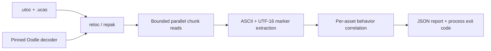

# Architecture

UEWorkshopScanner is a Rust CLI built around an in-process, fail-closed scan
pipeline:

## Container layer

[retoc](https://github.com/trumank/retoc) is pinned to commit
`d034ade1ae8117d4786eaf6b0418d4cf48474d7f`. It exposes virtual paths and
decompressed IoStore chunks without launching Unreal Engine or extracting
assets to disk.

retoc's upstream Oodle adapter can download a native decoder when one is
missing. A security scanner should not silently fetch and load native code, so
this repository replaces it with `vendor/oodle_loader_safe`. The replacement:

- contains no HTTP dependency;
- accepts only an explicit local path and SHA-256 digest;
- is initialized before worker threads start;
- fails when the decoder is unavailable or its digest differs.

Official Windows archives place an approved decoder beside the executable. The
CLI detects that file by name, independently hashes it, and accepts only the
reviewed digests in `src/main.rs`.

## Scan pipeline

1. Validate the `.utoc` entry point and companion `.ucas`.
2. Resolve and verify the Oodle decoder when required.
3. Open the IoStore through retoc.
4. Read and scan chunks in parallel through Rayon's bounded worker pool.
5. Decode ASCII plus aligned and unaligned UTF-16LE/UTF-16BE text views.
6. Assign normalized behavior markers.
7. Correlate markers within each cooked asset into findings.
8. Derive `allow`, `review`, `block`, or `incomplete`.
9. Emit deterministic JSON and a verdict-specific process exit code.

The collected chunk order is retained when parallel results are joined, so the
same input produces stable artifact and finding order.

## Completeness policy

`allow` is valid only when every non-empty chunk is read within the configured
size limit. A skipped oversized chunk, parser failure, missing decoder, missing
companion file, or unsupported container makes the run incomplete.

The current implementation returns errors as exit code `4` and never converts a
partial scan into `allow`.

## Rule model

Rules are intentionally based on correlated behavior rather than isolated
strings. For example:

- `BeginPlay` alone is ordinary game behavior.
- `ToFile` alone may be legitimate serialization.
- `powershell` in documentation is not a dropper.
- automatic execution plus user-directory discovery, script output, shell
  launch, and downloader markers is a high-confidence chain.

This reduces obvious false positives while preserving useful evidence in the
JSON report. It is still serialized-marker analysis, not full Kismet
control-flow reconstruction.

## Supply-chain boundary

- `Cargo.lock` is committed.
- retoc is pinned to an exact Git revision.
- upstream automatic Oodle downloading is removed.
- release packaging accepts only reviewed decoder hashes.
- release ZIPs include file-level and archive-level SHA-256 checksums.
- proprietary decoders, Workshop packages, and cooked Unreal assets are never
  committed.

See [OODLE_DISTRIBUTION.md](OODLE_DISTRIBUTION.md) for the Oodle distribution
decision and [THREAT_MODEL.md](THREAT_MODEL.md) for attacker-controlled input
boundaries.

## Future desktop integration

A graphical frontend should treat this CLI as a disposable worker rather than
linking the parser directly into the UI process. The worker should run:

- without network access;
- without administrator privileges;
- with read-only access to the selected Workshop item;
- under memory, CPU-time, and output-size limits;
- with a fresh process for each scan.

That boundary limits the impact of a future parser or native decompressor
vulnerability while keeping the CLI useful by itself.
