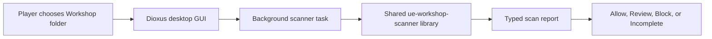

# Desktop GUI prototype

The player-facing Dioxus application lives in `gui/`. It is a presentation
layer over the existing `ue-workshop-scanner` Rust library, not a second
scanner.

## Boundary

For every scan, the GUI:

1. starts the scan on a blocking worker so the interface remains responsive;
2. selects the built-in `meccha-chameleon` game profile;
3. invokes the public `Scanner` facade from the root library;
4. receives the same typed `Report` used by the CLI;
5. writes a JSON copy below the user's local application-data directory;
6. treats unknown verdicts or incomplete analysis as blocked.

The GUI contains no detection rules. Container parsing, threat-family matching,
disposition, Oodle loading, and security decisions remain in the shared
library. The CLI and GUI are two frontends over that same engine, and players
do not need to install the CLI to use the desktop app.

## Player experience

The initial prototype includes:

- folder selection and native file/folder drop;
- complete first-run bundled-binary terms and explicit acceptance;
- one supported game profile: MECCHA CHAMELEON;
- one plain-language headline and recommended action;
- a short, readable reason list when anything is found;
- optional collapsed technical details and a shortcut to reveal the saved JSON
  report;
- persistent experimental and local-only positioning.

The application intentionally does not claim an `allow` result proves safety.
It presents the scanner as defense in depth, including when the current game
also has its own Workshop mitigations.

## Deferred

- Steam library and subscribed-item discovery;
- automatic game or UE4SS installation;
- scan history and settings;
- packaging the GUI into the GitHub release;
- additional Unreal game profiles.
