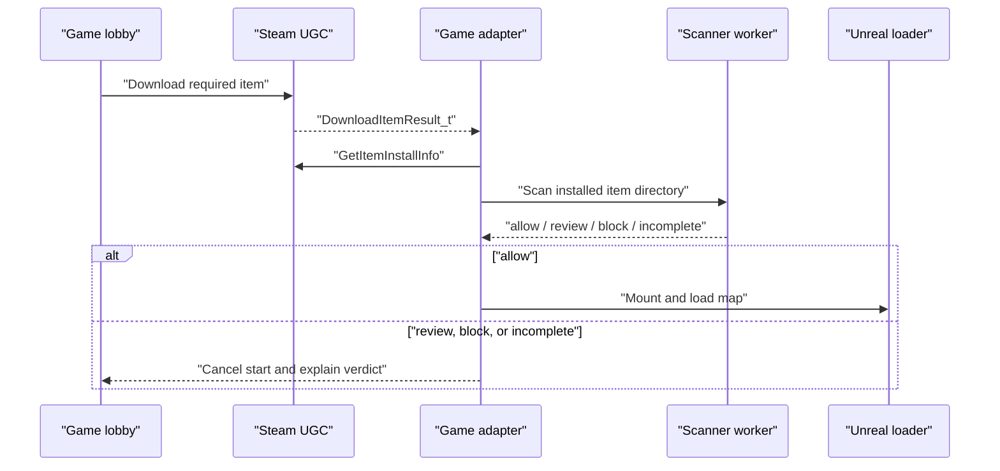

# Integration strategy

UEWorkshopScanner should remain a general Unreal Engine Workshop scanner.
Meccha Chameleon is the first target and the first source of
threat-family rules, fixtures, and integration requirements.

The core product boundary is:

```text
attacker-controlled Workshop item -> isolated scanner -> structured verdict
```

Game discovery, Steam library discovery, user interface, and enforcement belong
outside the detector. This keeps the scanner reusable while allowing each game
adapter to handle its own delivery and loading behavior.

## The Meccha download gap

Meccha can prompt a client to download the host's selected Workshop map from an
active lobby. In the documented malware incident, the game began loading the
map as soon as the download completed. That gives an external scanner little or
no time to finish before Blueprint initialization.

Meccha Chameleon 3.1.0 added a security patch for MOD maps. The scanner is
defense in depth for Meccha and a reusable foundation for Unreal games whose
Workshop boundaries may differ.

Local inspection confirms the standard Steam layout:

```text
steamapps/
  appmanifest_4704690.acf
  workshop/
    appworkshop_4704690.acf
    content/
      4704690/
        <published-file-id>/
          *.utoc
          *.ucas
          *.pak
          AssetRegistry.bin
          Content/
          Metadata/
```

The Workshop manifest records installed item IDs, content manifests, sizes, and
update state. It is useful for discovery and cache invalidation, but it is not
an enforcement boundary.

Valve's `ISteamUGC::DownloadItem` documentation says a game must wait for
`DownloadItemResult_t` before accessing the item on disk. `ItemInstalled_t` and
`GetItemInstallInfo` then identify the installed item and its directory. The
best integration point is therefore after a successful download result and
before the game mounts or opens the returned directory.

Sources:

- [Steamworks ISteamUGC documentation](https://partner.steamgames.com/doc/api/ISteamUGC)
- [Meccha Chameleon 3.1.0 announcement](https://steamcommunity.com/ogg/4704690/announcements/detail/680756685198854754)
- [Meccha Chameleon malware analysis](https://medium.com/@FeintBE/workshop-map-for-meccha-chameleon-is-a-malware-dropper-full-breakdown-d1ac29565265)
- [Meccha Chameleon unreal-shimloader package](https://thunderstore.io/c/meccha-chameleon/p/Thunderstore/unreal_shimloader/)
- [UE4SS `RegisterHook` documentation](https://docs.ue4ss.com/dev/lua-api/global-functions/registerhook.html)

## Integration paths

| Path | User experience | Can block before load? | Maintenance | Recommendation |
| --- | --- | --- | --- | --- |
| Manual CLI | User selects an item or directory | Only when used before launch | Low | Keep as the universal baseline |
| Launcher preflight | Scan installed items, then start the game | Yes for content already installed | Low | Build first |
| Companion watcher | Watch Steam manifests and item directories | Not reliably for immediate in-game loading | Medium | Use for alerts and cache warming |
| Game-side adapter | Gate the download-complete-to-mount transition | Yes | High and game-version-specific | Required for reliable Meccha blocking |
| Steam proxy DLL or process suspension | Interpose on the game or freeze it during scans | Technically possible, but fragile | Very high | Do not ship |
| Filesystem filter driver | Deny reads until a verdict exists | Yes | Extreme; requires privileged code | Out of scope |

### Manual CLI

The CLI is the stable integration contract. It accepts a Workshop item
directory and returns deterministic JSON plus a verdict-specific exit code. It
works for CI, researchers, mod managers, and games that can invoke an external
worker.

The crate now exposes `Scanner`, `ScannerOptions`, and public report types. JSON
reports include `schema_version: 1`; consumers should reject unsupported major
schema versions rather than guessing at changed semantics.

### Launcher preflight

A desktop launcher can:

1. discover Steam libraries;
2. locate `appworkshop_<app-id>.acf`;
3. enumerate installed Workshop item directories;
4. scan new or changed content;
5. show one combined decision;
6. start the game only after all required scans complete.

Cache entries should include:

- Steam App ID;
- Workshop published file ID;
- Steam content-manifest ID;
- scanner version;
- ruleset version;
- Oodle decoder digest;
- final verdict and completeness.

Any changed component invalidates the cached verdict. `incomplete` must never be
cached as `allow`.

This path protects normal startup and subscribed maps. It cannot stop a map
that the running game downloads and immediately loads.

### Companion watcher

A tray application can watch `appworkshop_<app-id>.acf`, the Workshop download
area, and installed item directories. It should debounce changes until the
Steam manifest reports a stable installed manifest and all expected container
files can be opened.

The watcher is still valuable:

- it can scan updates before the next game launch;
- it can warn about a blocked item;
- it can warm the verdict cache;
- it can provide a convenient user interface over the CLI.

It must not claim that it blocked an in-game load. Directory notifications can
arrive after the game has already received its Steam callback, and a complete
IoStore scan takes non-zero time.

### Game-side adapter

Reliable enforcement needs a small, game-specific gate:



An official integration could implement this cleanly. Without developer
cooperation, a community adapter would need to hook a game-specific method or
callback. That can enforce the decision, but it is brittle across game updates
and introduces its own injection and supply-chain risk.

Meccha already has a Thunderstore package for `unreal-shimloader`, which
provides profile-managed RE-UE4SS support. UE4SS can register callbacks for
reflected `UFunction` calls and load C++ mods. This makes an optional
Thunderstore adapter the most practical community prototype:

1. use UE4SS to observe the current game's lobby, download, mount, and travel
   functions;
2. identify a reflected function that runs after installation but before map
   loading;
3. hold that transition while a C++ adapter starts the Rust scanner worker;
4. resume only on a complete `allow` verdict;
5. show a game-native or overlay error for `review`, `block`, and `incomplete`.

This still needs runtime tracing. If the required boundary lives entirely in a
native Steam callback and is not exposed through a `UFunction`, the adapter
would need a version-specific native hook rather than a simple Lua hook.
UE4SS also warns that it is not plug-and-play for every game and may require
updated signatures after engine or game changes.

Keep the community Meccha adapter isolated under `integrations/meccha-ue4ss`
with these requirements:

- support only explicitly tested game build IDs;
- make it unmistakable when an unknown build is not protected;
- invoke the scanner as a disposable, unprivileged worker;
- never run the scanner inside the game process;
- never proxy or replace `steam_api64.dll`;
- verify the scanner binary and decoder before launch;
- provide a visible bypass only after an explicit warning;
- disable itself cleanly, without claiming protection, when hooks cannot be
  resolved.

## Proposed project shape

The repository can scale without baking Meccha assumptions into the scanner:

```text
crates/
  ue-workshop-scanner-core/   parsing, rules, classification, report contract
  ue-workshop-scanner-cli/    manual scan and automation interface
  ue-workshop-companion/      Steam discovery, cache, watcher, launcher
game-profiles/
  meccha-chameleon.toml       App ID, layout, container and integration metadata
integrations/
  meccha-ue4ss/               optional, version-gated in-game enforcement adapter
```

This is a target layout, not a reason to split the current small crate
immediately. Extract crates only when the companion needs the shared API. Until
then, keep detector modules independent of Steam and game-specific paths.

## Delivery order

1. **Version the scan contract.** Completed with schema version 1 and a public
   Rust facade.
2. **Add game profiles.** Started with Meccha App ID `4704690`.
3. **Trace the Meccha boundary.** Use the observe-only UE4SS prototype on a
   benign map to identify a cancellable, version-gated transition.
4. **Build launcher preflight.** Discover libraries, enumerate installed items,
   cache complete verdicts, and launch through Steam.
5. **Add watcher mode.** Scan stable new or updated Workshop manifests and
   notify the user without promising enforcement.
6. **Implement the Meccha gate only after validation.** Hold the exact
   download-to-load transition, fail closed, and expose protection status.
7. **Add games through evidence.** Require a public support request, benign
   fixture plan, layout evidence, compression details, and a named maintainer.

## Non-goals

- Replacing Steam's downloader.
- Automatically subscribing to Workshop items.
- Moving or deleting a user's subscriptions without consent.
- Treating popularity, ratings, or author age as proof of safety.
- Claiming an external watcher prevented a map from loading.
- Running privileged drivers or silently injecting into arbitrary games.
